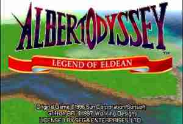

<div align="center">



# 🐉 ALBERT ODYSSEY: LEGEND OF ELDEAN
### Tradução PT-BR • por **GRIFFON BR**


*RPG de Sega Saturn (1997) traduzido do inglês para o português do Brasil —*
*52 mapas de diálogo e todo o texto de menus, itens, magias e batalha.*

</div>

---

> Este repositório **não contém o jogo**. Distribui apenas a tradução como um **patch** que você aplica sobre a sua própria cópia original.

## ✅ O que está traduzido

- **Diálogos** — 52 mapas, ~3.260 falas (abertura, cidades, NPCs, cenas, personagens)
- **Texto de sistema** — itens, armas, magias, nomes de monstros, status e mensagens de batalha

## 📦 Como aplicar (release)

Na pasta [`release/`](release/):

1. Tenha sua cópia original em BIN/CUE (USA) e Python 3 instalado.
2. Rode:
   ```
   python release/ao_patch_apply.py "CAMINHO/Albert Odyssey - Legend of Eldean (USA) (Track 01).bin"
   ```
   O aplicador valida sua cópia por checksum e grava a Track 01 traduzida.
3. Abra o `.cue` no seu emulador de Saturn (Ymir, Mednafen…) com a **BIOS do Saturn** configurada.

Detalhes em [`release/LEIA-ME.txt`](release/LEIA-ME.txt).

## 🗂️ Estrutura

| Pasta | Conteúdo |
|---|---|
| `release/` | Patch distribuível (`.aopatch`) + aplicador em Python + instruções |
| `tools/` | Ferramentas de engenharia reversa e reinserção (Python) usadas no projeto |
| `translation/dialogos/` | Traduções PT-BR dos diálogos (só o texto em português) |

## 🔧 Como funciona (resumo técnico)

- **Codificação do diálogo**: cifra de substituição simples — `ASCII = byte + 0x1F` — com códigos de controle ≥ `0xF5`. Ver [`tools/ao_codec.py`](tools/ao_codec.py).
- **Ponteiros**: cada mapa (`MAP*.TWN`) tem tabelas de ponteiros u32 big-endian em posições fixas; a reinserção reorganiza o texto dentro de cada "slot" entre tabelas e recalcula os ponteiros. Ver [`tools/ao_twn.py`](tools/ao_twn.py).
- **Imagem do disco**: patch in-place na Track 01 (MODE1/2352) com regeneração de EDC/ECC. Ver [`tools/ao_iso.py`](tools/ao_iso.py).
- **Texto de sistema**: reinserção in-place respeitando o tamanho de cada campo. Ver [`tools/sys_pipeline.py`](tools/sys_pipeline.py).

## ⚠️ Limitações conhecidas

- **Acentos**: a fonte do jogo não tem glifos acentuados, então os acentos aparecem "chapados" (`voce` em vez de `você`). Uma **v2** pretende editar a fonte para adicioná-los.
- Alguns textos foram condensados para caber no espaço original, preservando o sentido.

## 📜 Créditos

- Jogo original © 1996 **Sunsoft / Sun Corporation**
- Localização em inglês © 1997 **Working Designs**
- Tradução PT-BR: **GRIFFON BR**

*Projeto de fã, sem fins lucrativos. Marcas e conteúdo do jogo pertencem aos seus respectivos donos.*
